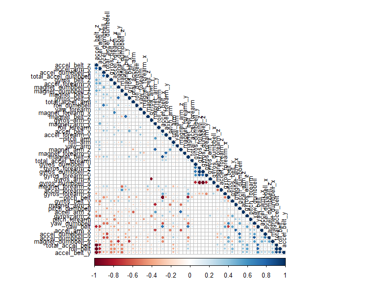

# Prediction Assignment Writeup
DT  
27.12.15  
# Executive Summary/Introduction
Using devices such as Jawbone Up, Nike FuelBand, and Fitbit it is now possible to collect a large amount of data about personal activity relatively inexpensively. These type of devices are part of the quantified self movement – a group of enthusiasts who take measurements about themselves regularly to improve their health, to find patterns in their behavior, or because they are tech geeks. One thing that people regularly do is quantify how much of a particular activity they do, but they rarely quantify how well they do it. In this project, our goal will be to use data from accelerometers on the belt, forearm, arm, and dumbell of six (6) participants. They were asked to perform barbell lifts correctly and incorrectly in five (5) different ways. More information is available from the website here: http://groupware.les.inf.puc-rio.br/har

## Data 
The training data for this project are available here: https://d396qusza40orc.cloudfront.net/predmachlearn/pml-training.csv. The test data are available here: https://d396qusza40orc.cloudfront.net/predmachlearn/pml-testing.csv. The data for this project come from this source: http://groupware.les.inf.puc-rio.br/har.

## Libraries
The following libraries are being used throughout the analysis. Do note that below we first check if the required packages are already install and if not, we install them.

```r
list.of.packages <- c("caret", "corrplot", "kernlab", "knitr", "randomForest")
new.packages <- list.of.packages[!(list.of.packages %in% installed.packages()[,"Package"])]
if(length(new.packages)) install.packages(new.packages)
library(caret)
```

```
## Loading required package: lattice
## Loading required package: ggplot2
```

```r
library(corrplot)
library(kernlab)
```

```
## 
## Attaching package: 'kernlab'
## 
## The following object is masked from 'package:ggplot2':
## 
##     alpha
```

```r
library(knitr)
library(randomForest)
```

```
## randomForest 4.6-12
## Type rfNews() to see new features/changes/bug fixes.
## 
## Attaching package: 'randomForest'
## 
## The following object is masked from 'package:ggplot2':
## 
##     margin
```


# Data
## Download and store the train and test data set

```r
# get and set wd
WD <- getwd()
setwd(WD)

# create a data folder in the working directory
if (!file.exists("data")) {dir.create("data")}

# file URL and destination file
fileUrl1 <- "https://d396qusza40orc.cloudfront.net/predmachlearn/pml-training.csv"
destfile1 <- "./data/pml-training.csv"
fileUrl2 <- "https://d396qusza40orc.cloudfront.net/predmachlearn/pml-testing.csv"
destfile2 <- "./data/pml-testing.csv"

# download the train and test data set
if (!file.exists("data/pml-training.csv")) {download.file(fileUrl1, destfile = destfile1)} 
if (!file.exists("data/pml-testing.csv")) {download.file(fileUrl2, destfile = destfile2)}
```

## Load data into R and tidy/clean data

```r
# load the train data set 
dtraining <- read.csv("./data/pml-training.csv", na.strings= c("NA",""," "))
```

## Tidying and cleaning data

```r
# clean the data by removing NAs
dtrainingNAs <- apply(dtraining, 2, function(x) {sum(is.na(x))})
dtrainingC <- dtraining[,which(dtrainingNAs == 0)]

# clean the data by removing the first 8 columns which act as data identifiers
dtrainingC <- dtrainingC[8:length(dtrainingC)]
```

# Model Creation
## Data splitting
The cleaned test data is split up into a train and a test set in a 60:40 ratio. The first data set is used to train the model and the second data set is used to test the model against data it is not specifically fitted to.

```r
# split the cleaned test data into a train and a test data set
inTrain <- createDataPartition(y = dtrainingC$classe, p = 0.6, list = FALSE)
training <- dtrainingC[inTrain, ]
testing <- dtrainingC[-inTrain, ]
```

## Model selection
A random forest model is selected to predict the classification. Using random forest, the out of sample error should be small and one should expect anything smaller than 3%. Random forest models do have methods for balancing error in class population unbalanced data sets.

## Exploratory data analysis
Before we proceed, it is important to conduct some preliminary exploratory data analysis and inspect tha data for high correlating variables. Therefore, a correllation plot is shown below to determine what the variables relationships are.

```r
# correlation matrix plot
cMatrix <- cor(training[, -length(training)])
corrplot(cMatrix, order = "FPC", method = "circle", type = "lower", tl.cex = 0.8,  tl.col = rgb(0, 0, 0))
```

 
By inspecting the plot one can see that there are no highly correlated predictors, so all of them can be included in the model. Take into account that the dark red and blue colours highlight the negative and positive relationship between the variables respectively.

## Model fit

```r
# fit a random forest model to predict the classe using all other variables as the predictor
model <- randomForest(classe ~ ., data = training)
model
```

```
## 
## Call:
##  randomForest(formula = classe ~ ., data = training) 
##                Type of random forest: classification
##                      Number of trees: 500
## No. of variables tried at each split: 7
## 
##         OOB estimate of  error rate: 0.69%
## Confusion matrix:
##      A    B    C    D    E  class.error
## A 3345    2    1    0    0 0.0008960573
## B   17 2256    6    0    0 0.0100921457
## C    0   11 2039    4    0 0.0073028238
## D    0    0   31 1898    1 0.0165803109
## E    0    0    1    7 2157 0.0036951501
```

## Test the model (40% of the original train data)
The model is used - below - to classify the remaining 40% of the original train data set.

```r
# test the model using the remaining 40% of original train data
predictTest <- predict(model, testing)
confusionMatrix(testing$classe, predictTest)
```

```
## Confusion Matrix and Statistics
## 
##           Reference
## Prediction    A    B    C    D    E
##          A 2229    3    0    0    0
##          B    8 1501    9    0    0
##          C    0   10 1358    0    0
##          D    0    0   18 1268    0
##          E    0    0    0    4 1438
## 
## Overall Statistics
##                                          
##                Accuracy : 0.9934         
##                  95% CI : (0.9913, 0.995)
##     No Information Rate : 0.2851         
##     P-Value [Acc > NIR] : < 2.2e-16      
##                                          
##                   Kappa : 0.9916         
##  Mcnemar's Test P-Value : NA             
## 
## Statistics by Class:
## 
##                      Class: A Class: B Class: C Class: D Class: E
## Sensitivity            0.9964   0.9914   0.9805   0.9969   1.0000
## Specificity            0.9995   0.9973   0.9985   0.9973   0.9994
## Pos Pred Value         0.9987   0.9888   0.9927   0.9860   0.9972
## Neg Pred Value         0.9986   0.9979   0.9958   0.9994   1.0000
## Prevalence             0.2851   0.1930   0.1765   0.1621   0.1833
## Detection Rate         0.2841   0.1913   0.1731   0.1616   0.1833
## Detection Prevalence   0.2845   0.1935   0.1744   0.1639   0.1838
## Balanced Accuracy      0.9979   0.9944   0.9895   0.9971   0.9997
```

This model yields a 99.2, 99.3% prediction accuracy and can thus be used to predict new data, namely be used on the original test data.

## Predict (use the model on the original test data)
The original test data are loaded into R and cleaned using the same strategy as for the original train data set. The model is then used to predict the classifications of the 20 results of this new data set.

```r
# clean the original test data
dtest <- read.csv("./data/pml-testing.csv", na.strings= c("NA",""," "))
dtestNAs <- apply(dtest, 2, function(x) {sum(is.na(x))})
dtestC <- dtest[,which(dtestNAs == 0)]
dtestC <- dtestC[8:length(dtestC)]

# predict the classes of the new data set
predictTest <- predict(model, dtestC)
predictTest
```

```
##  1  2  3  4  5  6  7  8  9 10 11 12 13 14 15 16 17 18 19 20 
##  B  A  B  A  A  E  D  B  A  A  B  C  B  A  E  E  A  B  B  B 
## Levels: A B C D E
```

## Conclusion
This model has proven to be very robust and adequately predict how well a person is performing over a given exercise, by using data from multiple measuring instruments. It is worth noting that the model used here is relatively simple and its implementation into R is also relatively straightforward.
